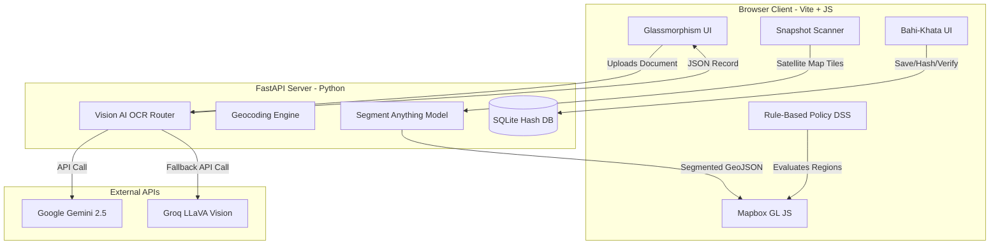
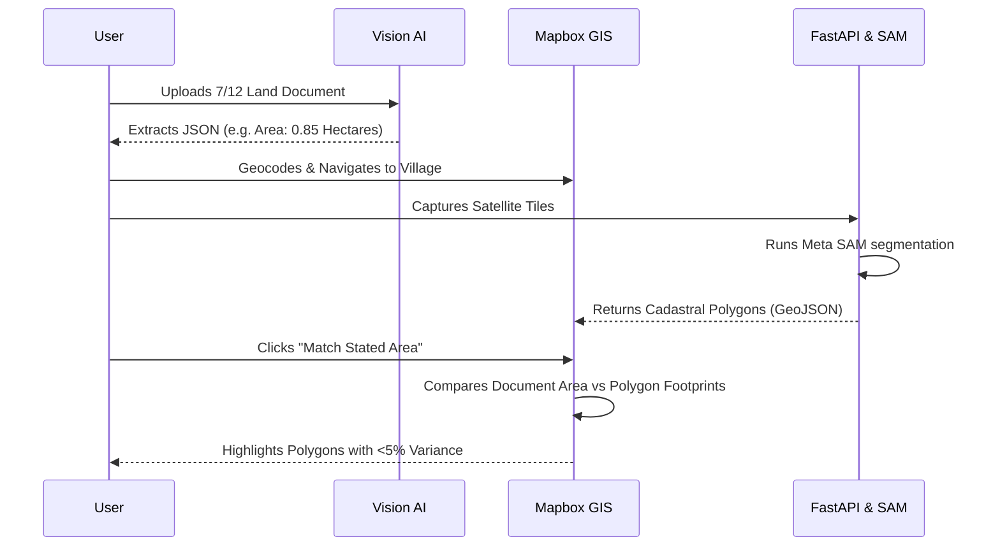
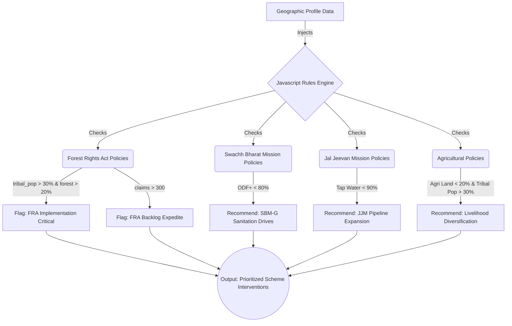

# GeoAdhikar: Intelligent Land Record Digitization & Validation System
**Comprehensive Technical Architecture & Implementation Write-up**

GeoAdhikar is a next-generation web-based Geographic Information System (WebGIS) and AI Decision Support System (DSS) designed to revolutionize the digitization, validation, and management of Indian legacy land records.

---

## 1. System Architecture Overview
The platform utilizes a modern decoupled architecture spanning edge-browser compute and robust backend AI execution.

**Technology Stack:**
- **Frontend**: Vanilla JavaScript (ES6+), Vite, Mapbox GL JS, HTML5/CSS3.
- **Backend**: Python 3.11, FastAPI, SQLite, Shapely, OpenCV, Uvicorn.
- **AI Models**: Google Gemini Vision, Groq LLaVA Vision, Meta's Segment Anything Model (SAM).

---

## 2. Core Technological Modules & Implementation

### A. Vision AI OCR Engine (Multilingual Legacy Document Parser)
Unlike traditional OCR engines (like Tesseract) which struggle with faded ink, skewed scans, and handwritten regional languages (Marathi, Hindi, etc.), GeoAdhikar employs state-of-the-art **Multimodal Vision-Language Models (VLMs)**.

*   **Technology**: Google Gemini Vision & Groq Vision API.
*   **Implementation**: Scanned documents (7/12 extracts, RoR) are sent as base64 images to the FastAPI backend. A highly engineered prompt forces the VLM to perform *zero-shot* extraction directly into a strict **Pydantic JSON schema**.
*   **Capabilities**: Natively reads handwritten Indian languages and extracts structured fields: State, District, Taluka, Village, Survey/Gat No, Khata No, Total Area, Owners, and active Bank Liabilities (Encumbrances). It also translates the legalese into an English summary.

### B. NLP-Powered Area Normalization Pipeline
Land areas in India are recorded in hyper-local units (Guntha, Bigha, Biswa, Ares, Hectares, Sq. Meters). 
*   **Technology**: Python Regex & Rule-based normalization logic.
*   **Implementation**: The backend parses the extracted text area string and normalizes it mathematically into standard global metrics: `parsed_area_sqm`, `parsed_area_ha`, and `parsed_area_acres`. This normalization is critical for downstream spatial math.

### C. Cryptographically Secured Digital Bahi-Khata (Record Book)
*   **Technology**: SQLite, Python `hashlib` (SHA-256).
*   **Implementation**: When a record is verified and saved, the backend stores it in a lightweight SQLite database. Crucially, before insertion, the system computes a **SHA-256 cryptographic hash** of the exact JSON data.
*   **Tamper-Proof Audit Trail**: Upon retrieval, the backend re-computes the hash of the data payload. If a malicious actor alters a database row directly (e.g., changing land ownership or area in the backend), the hash mismatch flags the record immediately in the UI with a red **[⚠️ TAMPERED (Hash Mismatch)]** badge.

---

## 3. Unique Selling Propositions (USPs) & Differentiators

### USP 1: Cadastral Satellite Area Matching (SAM)
Traditional digitization stops at converting paper to digital text. GeoAdhikar introduces a groundbreaking spatial validation loop.

*   **How it Works**: 
    1. The Mapbox Geocoder automatically navigates the map to the extracted village location.
    2. The backend runs SAM (or unsupervised rooftop/boundary detectors via OpenCV morphological operations) to generate polygonal footprints (`Polygon`/`MultiPolygon`) of physical land parcels.
    3. The frontend compares the *Document Stated Area* against the *Satellite Segmented Area*. 
    4. The system ranks the segmented plots by mathematical similarity, instantly highlighting encroachment, unregistered partitions, or legacy errors.

### USP 2: The Policy Decision Support System (DSS)
GeoAdhikar integrates an advanced rule-based scoring engine for regional administrators to apply demographic and spatial policies across various development sectors—not just forest rights, but agriculture, sanitation, and water security.

*   **Extensive Policy Coverage**: 
    - **Forest & Tribal Policy (FRA)**: Detects fringe forest populations lacking formalized rights based on spatial cover and demographic thresholds.
    - **Water Security (Jal Jeevan Mission)**: Prioritizes pipeline deployments in regions where household tap water access falls below safety thresholds.
    - **Sanitation (Swachh Bharat Mission)**: Identifies regions lacking ODF+ (Open Defecation Free) status for urgent sanitation interventions.
    - **Agricultural Support**: Flags regions with dangerously low agricultural land for livelihood diversification and agro-forestry schemes.

---

## 4. Why GeoAdhikar Stands Out
GeoAdhikar does not just digitize paper—it **spatially validates it, cryptographically secures it, and builds actionable policy insights upon it.** By combining Vision AI for unstructured data extraction, Computer Vision for satellite validation, and a Rule-Based Engine for policy application, it provides a comprehensive end-to-end modernized Land Administration ecosystem.
